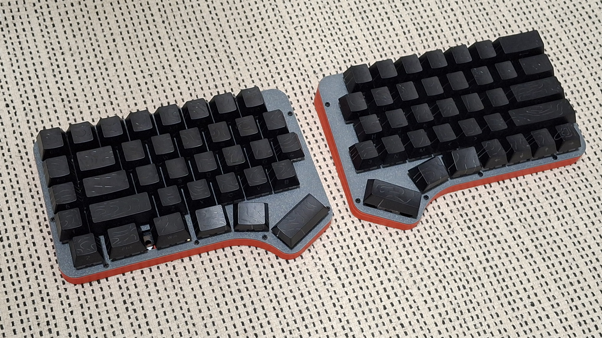
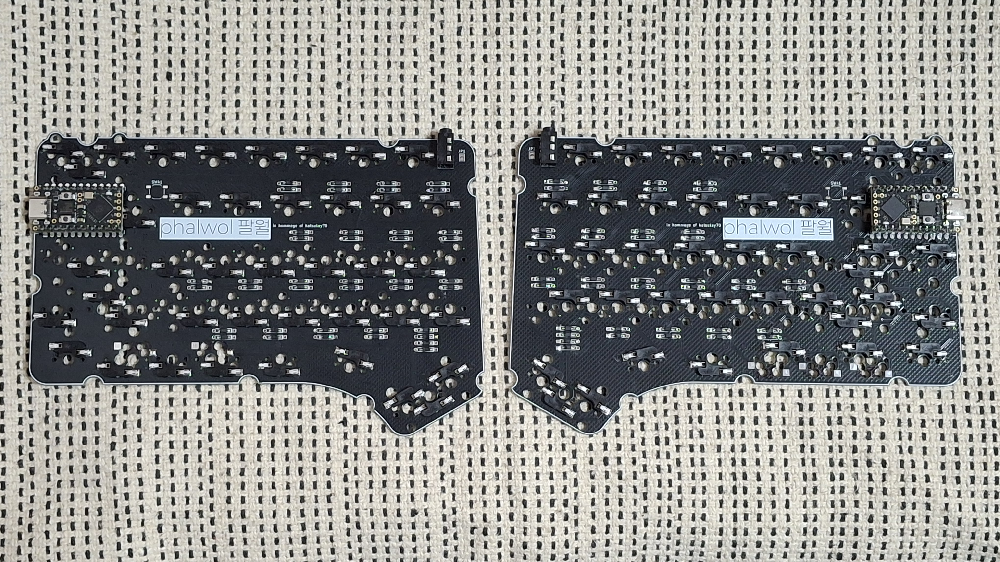
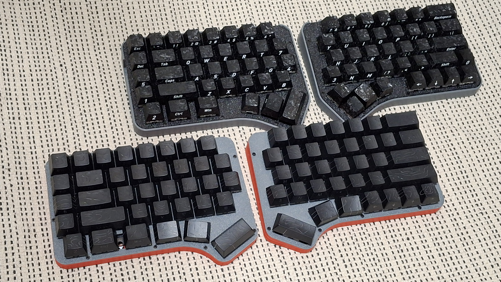

# phalwol
Row staggered 60% keyboard with reversible PCB, inspired by [Hatsukey70](https://scrapbox.io/Hatsukey/)

Hatsuki means August in Japanese, and phalwol means August in Korean. This keyboard layout is an hommage to Hatsukey70, so I want to credit the original design by name.

This keyboard has additional Y/H/B keys which positioned between keyboards, and auxilary row at left outside. you may put the keycaps from numpad.

This keyboard has hotswap-only PCB.

phalwol can change layout to followings:

- Split left shift, to ISO shaped one.(2.25u to 1.25u/1u)

- Split right shift, to HHKB inspired shape.(2.75u to 1.75u/1u)

- Split outside thumb keys(2u to 1u/1u)

- Split backspace(2u to 1u/1u)

- Can use stepped caps lock

## Preparation

- 2x pro micro form factor dev board

- 2x phalwol PCB Boards, provided from the repo

- 1x printed case sets, 2 parts total, provided from the repo (for thicker case, use "buffed")

- 1x 1.5-1.6T keyboard plate sets, 2 parts total, provided from the repo

- 80x diodes, normally 1N4148

- 84x Kailh hotswap sockets (or compatibles)

- 16x M2x6 screws, flathead

- 2x PJ320A 1/8(3.5mm) TRRS connector (MJ-4PP-9 in other name)

- 2x 4x4x1.5mm surface mount tact switches (optional, for dev boards without reset button)

- 1x 1/8(3.5mm) TRRS cable

- 1-6x PCB Mounted 2u Keyboard Stabilizers, normally 6

- 73-78x MX Keyswitches, normally 73

- 8x 10mm bumpon stickers

- A set of Keycaps, Full-size layout, ANSI preferred.

## Build Guides and Miscellaneous

[phalwol Build Guide](docs/buildGuide.md)

there's some notices before the build:

- You may solder all hotswaps before soldering the dev board.

- Assemble dev board with 2.5mm height pin headers on back side, assume that components side are faced up.

- Jump every jumpers on front side.

Also take a look at the sibiling, [ilwol](https://github.com/yuburoll/ilwol).

# Licenses

All codes are in MIT License.

Markdown documents and photos in docs/images folder are copyrighted, all rights reserved.

The case and layout design of Phalwol is licensed under CC BY-NC-SA 4.0 (Attribution-NonCommercial-ShareAlike) by default, with an additional limited permission for commercial use under the following conditions:

- You are an individual, not acting on behalf of any company or organization.
  
- Your revenue from a single batch of sales does not exceed $2,000.
  
- Your sales are occasional and limited in scope, not ongoing or continuous.

If you want to ask any, please contact the authors.

- me: yuburoll@gmail.com

- Murasaki, the author of original layout Hatsukey70: https://scrapbox.io/Hatsukey/%E4%BD%9C%E8%80%85%E9%80%A3%E7%B5%A1%E5%85%88
